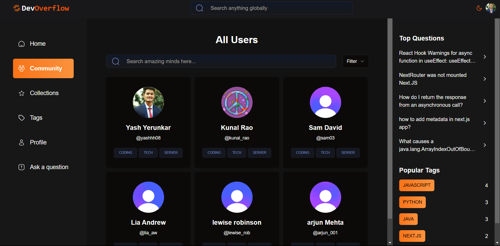
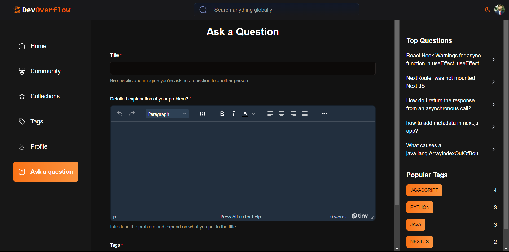

# DevOverflow - Community-Driven Programming Platform

Welcome to DevOverflow, a community-driven platform designed for asking and answering programming questions. Connect with developers worldwide, seek assistance, share knowledge, and collaborate on topics spanning web development, mobile app development, algorithms, data structures and more.

## Live

Explore DevOverflow live: [DevOverflow](https://devoverflow-yy.vercel.app/)

## Features

- **User Authentication:** Create a personalized account to fully engage with the community.
- **Themes:** Switch between light and dark themes for a comfortable viewing experience.
- **Multiple Layouts & Grouped Routes:** Explore a well-organized interface with various layout options and grouped routes for intuitive navigation.
- **Responsive UI:** Enjoy a responsive user interface that adapts seamlessly to different screen sizes.
- **Form Handling:** Efficiently handle forms for seamless user interactions.
- **Webhooks for Authentication Service:** Utilize webhooks for streamlined authentication services.
- **Filter and Search Functionality:** Easily filter and search across pages for quick access to relevant content.
- **Pagination:** Navigate through content effortlessly with paginated views.
- **Loading UI:** Experience a user-friendly loading interface for improved responsiveness.
- **SEO Optimization:** Enhance discoverability.

## Tech Stack

- **Next.js:** A React framework for building server-rendered applications.
- **Tailwind CSS:** A utility-first CSS framework for building responsive designs.
- **Shadcn UI:** Add visual appeal with the Shadcn UI component library.
- **MongoDB:** Store and manage data with the MongoDB database.
- **Vercel:** Deploy and host your application with Vercel for seamless scalability.

## Screenshots

## Enjoy exploring DevOverflow!
