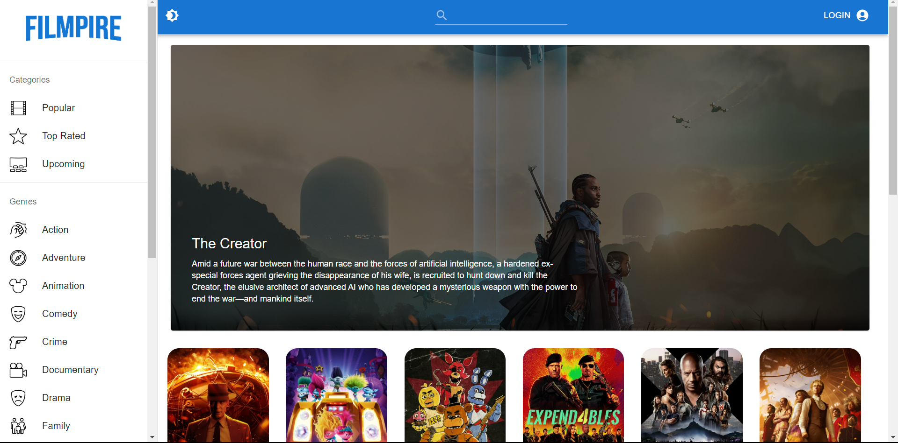
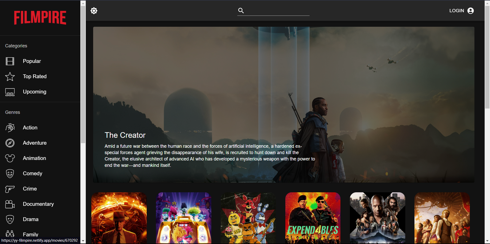
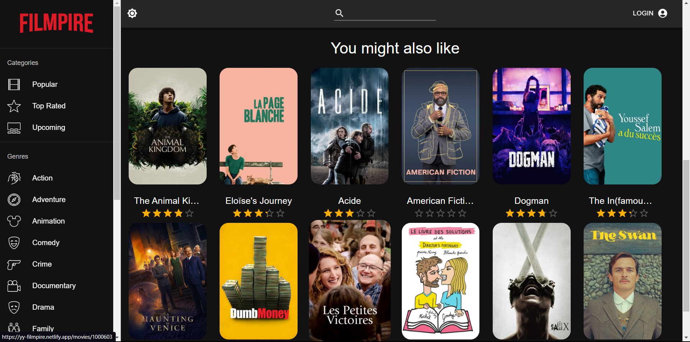
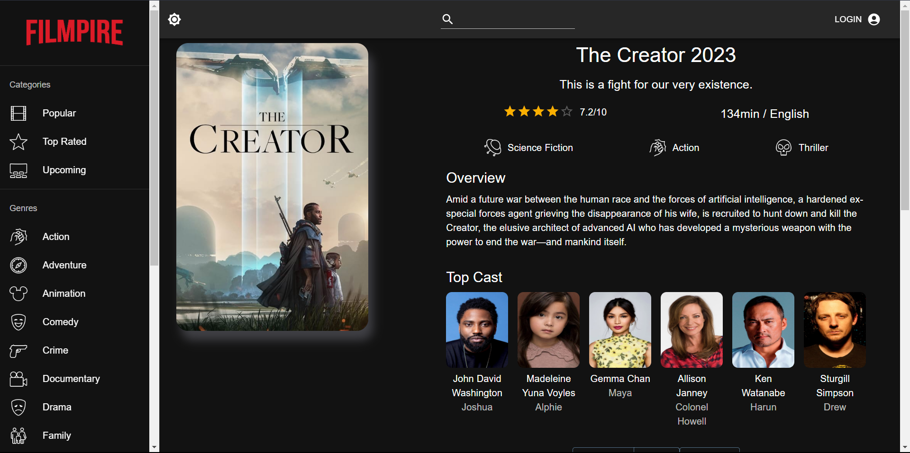
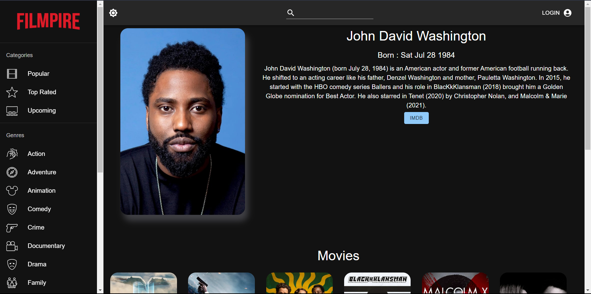

# Filmpire - Movie Exploration App

Welcome to Filmpire, a dynamic movie exploration application built with React, Redux and Material UI. Dive into the world of cinema, explore movies based on categories and genres and enjoy a visually appealing user interface that enhances your movie discovery experience.

## Live

Explore Filmpire live: [Filmpire](https://yy-filmpire.netlify.app/)

## Features

- **User Authentication:** Create a personalized experience by logging in to Filmpire.
- **Dark Mode:** Toggle between light and dark modes for a comfortable viewing experience.
- **Sort Movies:** Easily sort and filter movies based on categories or genres.
- **Movie Details:** View detailed information about movies, including trailers, cast, and synopsis.
- **Actor Details:** Explore in-depth details about your favorite actors and actresses.
- **Favorites & Watchlist:** Add movies to your favorites or watchlist for quick access.
- **And More:** Discover additional functionalities that make Filmpire your go-to movie companion.

## Tech Stack

- **React:** A powerful JavaScript library for building user interfaces.
- **Redux:** State management to keep the application data in sync.
- **Material UI:** A React UI framework for creating beautiful, responsive applications.

## Screenshots

## Enjoy exploring movies with Filmpire! 🎬🍿
